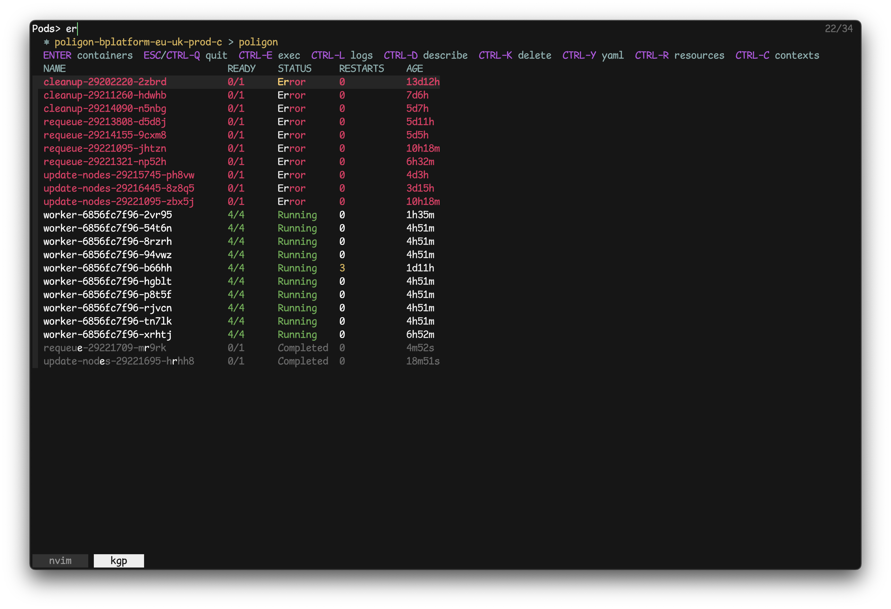

# `kgp` - kubectl get pods (and more)

**Lightning-fast, interactive Kubernetes resource browser powered by fzf**

[](LICENSE)
[](https://www.gnu.org/software/bash/)



## 🚀 Why `kgp`?

**Instant access to your Kubernetes resources.** No loading screens, no bloat, just pure speed.

- ⚡ **Sub-100ms startup** - Launch and start searching immediately
- 🪶 **Minimal footprint** - ~10MB memory usage, just a bash script
- 🎯 **Focused workflow** - Do one thing well: browse and interact with K8s resources
- 🔍 **Fuzzy everything** - Powered by fzf for lightning-fast filtering

## ✨ Features

- **Instant launch** - No initialization, no waiting
- **Interactive browsing** - Pods, containers, deployments, services, configmaps
- **Real-time updates** - Live resource status with smart caching
- **Multi-context aware** - Switch between clusters seamlessly
- **Essential operations** - exec, logs, describe, scale, delete
- **Searchable logs** - Fuzzy-filter a live stream, then hand any line to an
  editor or pager for copying
- **Debug pod creation** - Clone pods with sleep command for troubleshooting
- **Keyboard-driven** - Optimized for speed with intuitive shortcuts
- **Zero configuration** - Works out of the box with kubectl

## 📦 Installation

### Prerequisites

```bash
kubectl  # Kubernetes CLI
fzf      # Fuzzy finder (>=0.54.0 - the log viewer needs --wrap and --tail)
python3  # Pod list formatting
jq       # Debug pod creation
less     # Paging describe output
```

Also expected, and present on most systems: `awk` (gawk), `sed`, `grep`,
`curl`, `sort`, `tee`, `cut`, `mktemp`, `mkfifo`, `pgrep`. All of these are
checked at startup, so a missing one is reported immediately by name.

### Quick Install

```bash
git clone https://github.com/anhpt379/kgp.git
cd kgp
make install
```

## ⚙️ Configuration

### Environment Variables

```bash
export KGP_CACHE_REFRESH=30        # Cache refresh interval (seconds)
export KGP_CACHE_DIR="/tmp/kgp"    # Cache location
export KGP_DEBUG=1                 # Enable debug output
```

Log viewer:

```bash
export KGP_LOG_TAIL=5000           # Lines fetched per container
export KGP_LOG_VIEW_LINES=200000   # Lines fzf keeps in memory
export KGP_LOG_EDITOR="nvim -u NONE --noplugin"   # Editor for CTRL-V
export KGP_LOG_DIR="$HOME/.cache/kgp/logs"        # Where log streams spill
```

`KGP_LOG_DIR` deliberately defaults to a disk-backed path rather than
`KGP_CACHE_DIR`, because that defaults to `/tmp`, which is `tmpfs` on many
systems and would hold a large log dump in RAM.

`KGP_LOG_EDITOR` runs without user config on purpose. A 100MB log buffer
opens in about 0.14s that way, versus minutes once plugins start inspecting
it. Skipping the config also leaves the mouse alone, so the terminal's own
drag-select keeps working for copying.

### Log viewer keys

`CTRL-O` opens logs in a second fzf pane, so filtering is fuzzy and `ESC`
goes back the same way it does everywhere else.

| Key | Action |
| --- | --- |
| `ESC` / `CTRL-C` | Back to the previous view |
| type anything | Filter log lines |
| `TAB` | Select a line (repeat for more) |
| `CTRL-Y` | Copy selected lines to clipboard |
| `CTRL-V` | Open the full log in an editor, on the current line |
| `CTRL-G` | Jump to the newest line |
| `ALT-G` | Jump to the oldest line |
| `CTRL-/` | Toggle the full-line preview pane |

While the filter is empty the cursor stays pinned to the newest line, so a
busy pod scrolls like `tail -f`. Type a filter to hold position.

Long lines are truncated rather than wrapped, so one screen row is always one
log line and the list stays scannable. The pane underneath, labelled "full
line" on its border, carries the full text of the line under the cursor,
wrapped. For a line that needs reading alongside its neighbours, `CTRL-V`
opens the whole stream at that line.
`CTRL-Y` also copies from the stream rather than the display, so a truncated
line is still copied in full.

The full stream is written to a file as it arrives, which is what `CTRL-V`
opens. That file covers everything fetched, even when the pane itself is
capped by `KGP_LOG_VIEW_LINES`. It is removed when the view closes.

The viewer leaves `CTRL-H`, `CTRL-J`, `CTRL-K`, `CTRL-L`, `CTRL-N` and
`CTRL-P` unbound, since those are often remapped before the terminal sees
them. Use the arrow keys to move the cursor.

## ❓ FAQ

### Why is there no "switch namespace" action?

This is an intentional design decision. `kgp` focuses on speed and simplicity,
and avoids managing mutable global state like the current namespace.

Instead, it's recommended to create a context with your desired namespace:

- Create a new context with your desired namespace:

  ```bash
  kubectl config set-context your-new-context --namespace="<namespace>" --cluster="<cluster>" --user="<user>"
  ```

- Then use `CTRL-S` in `kgp` to switch between contexts, including those with
  specific namespaces.
